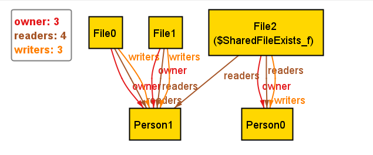
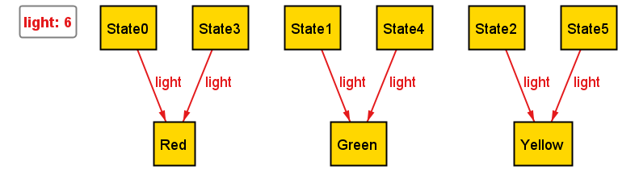

# Relational modeling with Alloy

```{note}
**Chapter roles (Spring 2026)**  
Author: Jake Triester · Reviewer: Michael Smith  
See [Chapter assignments](0-chapter-assignments.md).
```

This chapter introduces **Alloy** for lightweight formal modeling of structures and behaviors as relations.

## Goals

- Explain Alloy's relational style.
- Present a small model, instance visualization, and a checked assertion or property.
- Explore a further aspect depending on your interest.
- Point readers to the Alloy Analyzer documentation and tutorials.

## Draft

## Introduction

Alloy is a formal specification language made for describing software structures and behavior. It was created at MIT by Daniel Jackson in the late 1990's. Alloy is not a programming language, i.e. you don't use it to build running software. Instead, you use it to describe the structure and rules of a system, and then use the [**Alloy Analyzer**](https://alloytools.org) tool to find examples, counterexamples, and/or logical contradictions in your design.

## Alloy's Relational Style

While most programming languages make you think in terms of objects and variables, Alloy makes you think in terms of relations. 

Everything in Alloy is a relation. It doesn't matter if it is one value (a relation with one element), two values (a binary relation), or many many more. Alloy relies on relations to be able to solve many problems.

### Signatures

The basic building block in Alloy is a **signature** (`sig`), which declares a set of featureless objects to exist in your model (called atoms).

For example

```alloy
sig Person{}
sig File{}
```

What this says it that in our model, there exists a kind of thing (object) called Person, and something else called File. When the Alloy Analyzer is used, it will create concrete atoms (Person0, Person1, File0, etc.) when it builds an instance of the model.

### Fields

Inside a signature, you can declare fields that define relations between different atoms; there are a few keywords that let you constrain how the relation works:

| Keyword | Meaning              |
|---------|----------------------|
| `one`   | Exactly one          |
| `lone`  | Zero or one          |
| `some`  | One or more          |
| `set`   | Zero or more (default) |

In our example, we can create a few fields in our `Person` signature like this:

```alloy
sig Person {
    owns: set File,
    manager: lone Person
}
```

Using the keywords, we can interpret these fields as meaning:
- Each Person owns a *set* of files (zero or more)
- Each Person has *at most one* manager (who is a Person)

Formally, a **binary relation** *R* from a set *S* to a set *T* is a subset of the Cartesian product *S* × *T* — that is, a set of ordered pairs *(s, t)* where *s* ∈ *S* and *t* ∈ *T*. In Alloy, every field is such a relation: `owns` is a binary relation from `Person` to `File`, and `manager` is a binary relation from `Person` to `Person`.

The dot (`.`) operator in Alloy is **relational composition**. Given a relation *R* ⊆ *S* × *T* and a relation *Q* ⊆ *T* × *U*, their composition *R.Q* ⊆ *S* × *U* is defined as:

> *R.Q* = { *(s, u)* | ∃ *t* ∈ *T* : *(s, t)* ∈ *R* and *(t, u)* ∈ *Q* }

In other words, you can reach *u* from *s* via *R.Q* if there is some intermediate element *t* that *s* relates to via *R* and that relates to *u* via *Q*. (See [Wikipedia: Composition of relations](https://en.wikipedia.org/wiki/Composition_of_relations#Definition) and the [Haslab relational logic primer](https://haslab.github.io/formal-software-design/relational-logic/index.html#composition) for further reading.) For example, `p.owns` gives you the set of all files owned by `Person p` — it navigates the `owns` relation starting from the singleton set `{p}`. You can also use `Person.owns` to give the set of all files owned by any `Person`.

### Facts

Once you have defined the atoms in your model, and how they relate to each other, you need to state the rules. This is where a `fact` comes in. A `fact` is a constraint that must always be true in every instance.

Continuing our example:

```alloy
fact NoSelfManagement {
  no p: Person | p in p.manager
}

fact OwnershipIsExclusive {
  all f: File | lone owns.f
}
```

These facts tell us the following:
- No person can be their own manager
- Every file is owned by at most one person

To create these facts, you can think of it as a 3 step process:
1. Declare your variable (`no p: Person` or `all f: File`)
2. Write the `|` symbol (read as "such that" — this is [set-builder notation](https://en.wikipedia.org/wiki/Set-builder_notation))
3. Write the property/condition about your variable (`p in p.manager` or `lone owns.f`)

### Predicates

A **predicate** (written as `pred`) is a named, reusable condition. Predicates do not necessarily constrain the model on their own, but can be invoked with the `run` command, or used inside other constraints.

For example:

```alloy 
pred HasNoManager[p: Person] {
  -- p has no manager (they're at the top of the hierarchy)
  no p.manager
}
```

This can be run with `run HasNoManager for 4 Person, 4 File`, and the Alloy Analyzer will show you a world where at least one person has no manager.

### Assertions

An **Assertion** (written as `assert`) states some property that you believe must hold given your facts. Then, you can ask the Analyzer to try to find a counterexample that satisfies all facts, but violates the assertion.

For example:

```alloy
assert ManagerOwnsAtLeastOneFile {
  -- Every person who manages someone owns at least some file
  all p: Person | (some p.~manager) implies (some p.owns)
}

check ManagerOwnsAtLeastOneFile for 4
```

Firstly, a new symbol that we can see here is the `~` symbol in `~manager`, which means the *reverse* of the `manager` relation (people managed by `p`). When we run `check ManagerOwnsAtLeastOneFile for 4`, this means that we are asking the Analyzer to find a counterexample for up to 4 atoms per type. If it reports "No counterexample found", that is strong evidence that your assertion holds, but it is not necessarily proof. However, in our example, it **will** find a counterexample because there is no fact enforcing that a manager must own a file, proving that the assertion is false.

To look for a counterexample, the Analyzer doesn't just abstractly reason about your model when you run a `check` command. It actually translates the whole model and the negation of the assertion into a boolean satisfiability (SAT) problem. From there, there is an underlying SAT solver that is able to determine any counterexamples.

### Extends and Abstract

Signatures can create subtypes from other signatures using the keyword `extends`. Subtypes are separate from each other and are subsets of the parent type.

The keyword `abstract` can be used to prevent any atom from being a plain instance of that signature. Each atom must belong to one of its subtypes.

For example:

```alloy
abstract sig Person{}
sig Employee extends Person {}
sig Guest extends Person {}
```

Here, each `Employee` and each `Guest` are a `Person`, but it is impossible to be both an `Employee` and a `Guest`. Constraints can be written that apply to all members of `Person`, or can be more specific and only apply to `Employee` or `Guest`, respectively. Since `Person` is an `abstract` signature, that means that you cannot create an atom that is just a `Person`; it must be either a `Guest` or an `Employee`.


## A Small Full Model

Now that we understand all of the keywords and how to use them, here is an example of a realistic model, a file system with owners and read/write permissions. As in the facts above, the `|` symbol throughout is set-builder notation — read it as "such that", separating the bound variable from the condition it must satisfy.

```alloy
-- Signatures
sig Person {}

sig File {
  owner: one Person,
  readers: set Person,
  writers: set Person
}

-- Facts
fact WritersCanAlwaysRead {
  -- Anyone who can write to a file can also read it
  all f: File | f.writers in f.readers
}

fact OwnerHasWriteAccess {
  -- The owner of a file always has write access
  all f: File | f.owner in f.writers
}

-- Predicate: a scenario with at least one shared file
pred SharedFileExists {
  some f: File | #f.readers > 1
}

-- Assertion: owners always have read access (should follow from our facts)
assert OwnerCanAlwaysRead {
  all f: File | f.owner in f.readers
}

check OwnerCanAlwaysRead for 4

run SharedFileExists for 3 Person, 3 File
```

When you run `check OwnerCanAlwaysRead for 4`, the Analyzer will find no counterexample because the `OwnerHasWriteAccess` fact guarantees that `f.owner in f.writers`, and the `WritersCanAlwaysRead` fact guarantees that `f.writers in f.readers`, so by transitivity, the owner is always a reader. The Analyzer went through this chain of reasoning automatically and confirmed that there was no counterexample.

When you run `run SharedFileExists for 3 Person, 3 File`, the Alloy Analyzer will display an instance visualization — a graph with concrete atoms and arrows showing their relations. The figure below is representative of what this output looks like:



## A Further Aspect - Ordering and Dynamic Models

In all of our examples so far, the models have been static. Meaning, they describe what the world looks like at a specific instance, not how it changes over time. However, many systems involve cycling through many different states: a door locks and unlocks, a user logs in and out, a traffic light cycles through colors, etc. 

In this section we will focus on a traffic light system. In Alloy, we can achieve this with the `util/ordering` module.

### Setting up the States

```alloy
open util/ordering[State]

abstract sig Color {}
one sig Red, Yellow, Green extends Color {}

sig State {
  light: one Color
}
```

Using the keyword `one sig` means that only 1 atom of that signature can exist. This means that in every instance, there is only 1 `Red`, 1 `Yellow`, and 1 `Green`.

### Transitions

Because we opened the module at the beginning, we are able to use the keywords `first`, `last`, and `next` to refer to our states.

```alloy
fact ValidTransitions {
  all s: State - last |
    let sn = s.next |
      (s.light = Red    implies sn.light = Green)  and
      (s.light = Green  implies sn.light = Yellow) and
      (s.light = Yellow implies sn.light = Red)
}

fact StartsOnRed {
  first.light = Red
}
```

`State - last` is used to say "every state besides the last one". This is important because the last state has no `next`, so we need this line to avoid our system crashing. The `let` keyword is just used so that we don't have to write `s.next` each time, and can just write `sn` instead. In our system, we are stating the fact that the light starts on red because it needs to start at some state.

### Running and Checking

If you run the line:

```alloy
run {} for 6 State
```

The Analyzer will show a chain of 6 states: `Red` → `Green` → `Yellow` → `Red` → `Green` → `Yellow`, just as expected. The figure below shows what this transition system looks like in the Analyzer:



### Assertions

As we know, a traffic light should never go from `Red` straight to `Yellow`. We can check that with an assertion:

```alloy
assert NeverRedToYellow {
  all s: State - last |
    s.light = Red implies s.next.light != Yellow
}

check NeverRedToYellow for 8 State
```

The Analyzer doesn't show any counterexamples, proving that our assertion is true.

## Real-World Case Studies

Here are a few examples of Alloy being used in industry:

**Amazon Web Services — TLA+ and Alloy for distributed systems.** Engineers at AWS have used Alloy to model and debug distributed systems designs, finding subtle concurrency bugs that testing alone missed. Chris Newcombe's 2011 paper *Debugging Designs* describes using Alloy to catch design-level errors in transaction systems before any code was written.

**Web security — the Same-Origin Policy.** Researchers at MIT (Kang, Perez De Rosso, and Jackson)
modeled the browser Same-Origin Policy in Alloy to precisely characterize what it does and does not
guarantee. Because the policy is enforced inconsistently across browsers, informal descriptions are ambiguous. To combat that, Alloy made the rules unambiguous and mechanically checkable. The writeup is freely available in the [*500 Lines or Less*](http://aosabook.org/en/500L/the-same-origin-policy.html) book.

These cases share a common theme: Alloy is most valuable not for proving full correctness, but for
**finding design flaws early**, before implementation begins.

## Resources

The best way to truly learn how Alloy works and how to utilize it is to build models and run them. Here are the resources to do that:

- [Alloy Analyzer](https://alloytools.org): The official website to download the Alloy Analyzer tool.

- [Alloy Documentation](https://alloy.readthedocs.io/en/latest): The reference documentation for the language that can answer any questions you might have.

- [Alloy4Fun](http://alloy4fun.inesctec.pt/): A website that lets you run Alloy without having to download anything to your machine.

- [VS Code Alloy extension](https://marketplace.visualstudio.com/items?itemName=ArashSahebolamri.alloy): Allows you to execute Alloy code directly in your IDE.