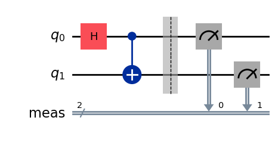
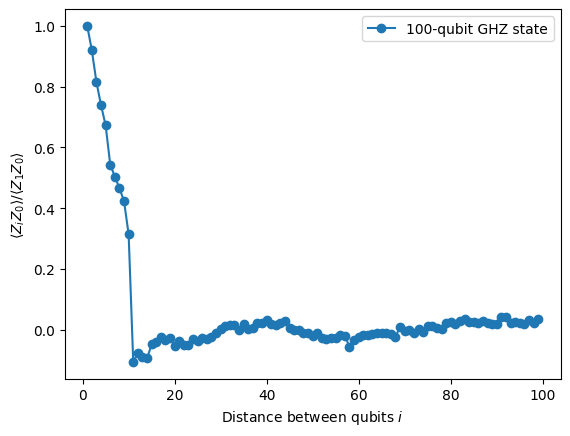
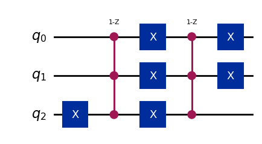
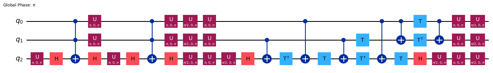
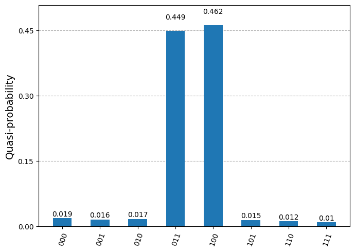

# Quantum programming with Qiskit

```{note}
**Chapter roles (Spring 2026)**
Author: Nataniel Farzan · Reviewer: Ethan Tapia
See [Chapter assignments](0-chapter-assignments.md).
```

This chapter introduces **Qiskit** for designing and running quantum circuits (simulation or hardware where available).

## Goals

- Give just enough quantum computing background to read a short circuit.
- Show a runnable Qiskit example with measurement and interpretation of results.
- Explore a further aspect depending on your interest.
- Link to IBM Qiskit documentation, textbooks, and simulators.

## Draft

### Introduction

[Qiskit](https://www.ibm.com/quantum/qiskit) is an [open-source Python library](https://github.com/Qiskit/qiskit) developed by IBM for interacting with quantum computers. It supports simulating small quantum circuits on classical hardware in addition to interacting with cloud quantum providers for more complex workloads. Popular use cases for the library include quantum information science experimentation, hybrid orchestration of quantum and classical resources, and the development of quantum algorithms. Qiskit is advertised as a complete quantum computing solution including tools for preprocessing, hardware optimization, postprocessing, and visualization.

This chapter starts with background information about classical and quantum computing, qubits, and common quantum gates. The remainder of the text provides tutorials and examples for using the Qiskit library to simulate simple circuits on local hardware, connecting to the [IBM Quantum Platform](https://quantum.cloud.ibm.com), and executing one of the foundational algorithms in the field of quantum computing on real hardware.

### Background

#### Classical Computing

The fundamental unit of information in classical computing systems is the bit (binary digit), which can represent either 0 or 1. Depending on the underlying physical medium, bits can be represented in a variety of ways: electrical charge, magnetization, light intensity, etc. Bits are used to store data and perform logical operations that modify the state of the system. Logic gates perform operations on one or more binary inputs to produce a single output. Common logic gates include AND, OR, and NOT gates. These operations can be modeled using boolean algebra to design complex logic circuits that perform desired functions.

Gordon Moore, the co-founder and former CEO of Intel, famously predicted that the number of transistors in integrated circuits would double roughly every two years (a prediction that would later be known as Moore's law). This rule of thumb has held for several decades, but we are approaching the physical limits to how small transistors can be. Therefore, a new architectural approach is needed to move beyond Moore’s Law and build upon many-core architectures.

#### Quantum Theory

Our physical world is governed by the fundamental laws of physics. While classical physics can be used to describe pheneomena at macroscopic and microscopic scales, quantum physics models submicroscopic and subatomic properties. A foundational understanding in quantum theory is required to explain electromagnetism, the strong force, the weak force, and gravity. Quantum systems are known to exhibit properties of both particles and waves (a concept known as wave-particle duality). One of the field's defining features that is not present in classical mechanics is quantum entanglement, or the idea that quantum states in a group cannot be described independently, regardless of the distances between them.

#### Quantum Computing

##### Qubits

The basic unit of information in quantum computing systems is the qubit (quantum bit). Unlike a classical bit, which exists in exactly one of two possible states, a qubit can be in an arbitrary superposition of all computable states simultaneously. Quantum computers are fundamentally different from classical computers because they can act on every state in the superposition at once. While it is possible to represent qubits classically, as the size of the system grows, quantum computers become extremely difficult to simulate with a classical computer. Qubits can be represented by a linear combination of two basis vectors: $| 0 \rangle ={\bigl [}{\begin{smallmatrix}1\\0\end{smallmatrix}}{\bigr ]}$ and $| 1 \rangle ={\bigl [}{\begin{smallmatrix}0\\1\end{smallmatrix}}{\bigr ]}$. Therefore, the state of a qubit is a vector in a two-dimensional vector space, which is known as the state space.

> The conventional notation used to represent qubits is known as **bra-ket notation** or **Dirac notation**. A **ket** (column vector) is of the form $| v \rangle$ and represents a quantum states, while a **bra** (row vector) is of the form $\langle f |$ and corresponds to the complex conjugate transpose of a ket. While it is convention to use bra-ket notation to describe quantum states as elements of a complex Hilbert space, the underlying representation is always two-dimensional row and column vectors. $| \psi \rangle$ is often used to denote an arbitrary quantum state.

The two orthonormal basis states, $| 0 \rangle$ and $| 1 \rangle$, form the computation basis that span the two-dimensional linear vector space of the qubit. Therefore, all possible qubit states can be described by a linear combination of these two states: $| \psi \rangle = \alpha | 0 \rangle + \beta | 1 \rangle$.

##### Quantum Gates

Quantum gates perform logical operations on qubits. Common quantum gates are shown in the table below.

| Name           | Symbol | # qubits | Description                                                         |
| -------------- | ------ | -------- | ------------------------------------------------------------------- |
| Identity       | $I$    | 1        | Returns the input                                                   |
| Pauili X / NOT | $X$    | 1        | Inverses the input (equivalent to a classical bit flip)             |
| Pauli Y        | $Y$    | 1        | Flips the bit and phase of the input                                |
| Pauli Z        | $Z$    | 1        | Flips the phase of the input                                        |
| Controlled NOT | $CNOT$ | 2        | Inverses the second qubit when the first qubit is $\vert 1 \rangle$ |
| Hadamard       | $H$    | 1        | Transforms the input into a superposition of states                 |

### Qiskit

#### A Simple Quantum Circuit

The following code snippet represents a Bell state (two entangled qubits):

```python
from qiskit import QuantumCircuit
from qiskit.primitives import StatevectorSampler

qc = QuantumCircuit(2)  # Instantiate a quantum circuit with 2 qubits
qc.h(0)                 # Apply a Hadamard gate
qc.cx(0, 1)             # Apply a Controlled-X gate
qc.measure_all()        # Adds measurement to all qubits

sampler = StatevectorSampler()
result = sampler.run([qc], shots=1024).result()
print(result[0].data.meas.get_counts())
```

The expected output is a near-even split between '00' and '11'. The corresponding quantum circuit (generated by `qc.draw("mpl")`) is shown in the figure below.



#### Running Circuits on Quantum Hardware

While small quantum circuits can be simulated on classical hardware, scaling up to larger circuits requires quantum computing hardware. The [IBM Quantum Platform](https://quantum.cloud.ibm.com) allows you to execute circuits defined with Qiskit on their quantum processing units (QPUs).

The following function creates an an n-qubit GHZ state (extended Bell state).

```python
def get_qc_for_n_qubit_GHZ_state(n: int) -> QuantumCircuit:
    if isinstance(n, int) and n >= 2:
        qc = QuantumCircuit(n)
        qc.h(0)
        for i in range(n - 1):
            qc.cx(i, i + 1)
    else:
        raise Exception("n is not a valid input")
    return qc
```

This code snippet uses the `ZZ` operators between qubits to examine the behavior as they get farther apart.

```python
# ZZII...II, ZIZI...II, ... , ZIII...IZ
operator_strings = [
    "Z" + "I" * i + "Z" + "I" * (n - 2 - i) for i in range(n - 1)
]

operators = [SparsePauliOp(operator) for operator in operator_strings]
```

Then, the circuit must be prepared to run on quantum hardware and the output must be post-processed (these steps excluded here for brevity, see the [documentation](https://quantum.cloud.ibm.com/docs/en/guides/hello-world) for more details). The following plot shows that as the distance between qubits increases, the signal quickly decays because of the presence of noise.



#### Grover's Algorithm

Created by Lov Grover at Bell Labs in 1996, Grover's algorithm is one of the most fundamental algorithms in the field of quantum computing. The algorithm is designed for [unstructured search](https://quantum.cloud.ibm.com/learning/en/courses/fundamentals-of-quantum-algorithms/grover-algorithm/unstructured-search) problems, where it can be used to determine whether an input that satisfies a black box function (also known as an oracle function), $f$ exists in $O(\sqrt{N})$ time complexity (where $N$ is the size of the function's domain). By contrast, classical computing approaches would require searching the entire input space for a solution, resulting in a worst-case time complexity of $O(N)$, with an average of $N / 2$ steps. A more formal statement of this problem, which can be described as searching for string $x$ that causes $f$ to evaluate to $1$, is shown below.

$$
\text{Input: a function} \ f:\Sigma^n\rightarrow\Sigma \\
\text{Output: a string} \ x\in\Sigma^n \ \text{satisfying} \ f(x) = 1\text{, or ``no solution'' if no such string}\ x \ \text{exists}
$$

The following code snippet creates a quantum circuit with 3 qubits and marks two target states (`011` and `100`) that Grover's algorithm will search for. This circuit serves as the input oracle function.

```python
marked_states = ["011", "100"]
qc = QuantumCircuit(3)
for target in marked_states:
    # Flip target bit-string to match Qiskit bit-ordering
    rev_target = target[::-1]
    # Find the indices of all the '0' elements in bit-string
    zero_inds = [
        ind
        for ind in range(num_qubits)
        if rev_target.startswith("0", ind)
    ]
    # Add a multi-controlled Z-gate with pre- and post-applied X-gates (open-controls)
    # where the target bit-string has a '0' entry
    if zero_inds:
        qc.x(zero_inds)
    qc.compose(MCMTGate(ZGate(), num_qubits - 1, 1), inplace=True)
    if zero_inds:
        qc.x(zero_inds)
```

This results in the circuit shown below.



Applying Qiskit's built-in `grover_operator()` function to the circuit results in a new circuit that amplifies the states marked by the oracle function.



Repeated execution of the Grover operator amplify the marked states, increasing their probability in the circuit's output distribution. The optimal number of applications is determined by the ratio of the number of marked states (which is 2 in this case) to the total number of possible computational states (3 qubits results in 8 possible states).

After optimizing the circuit for execution on quantum hardware and sampling the output, a probability distribution similar to the following plot will be returned. The algorithm dramatically amplified the amplitudes of the two marked states (`011` and `100`), which shows a successful application of Grover's algorithm on quantum hardware.



### Conclusion

Quantum computing is an emerging field with foundations in quantum mechanics and classical computing. Qiskit is a Python library for specifying, executing, and visualizing quantum circuits. This chapter briefly introduced the theoretical foundations of quantum computing, basics of the Qiskit library, and executing circuits on quantum hardware.

### References & Resources

#### Qiskit

- [Quickstart](https://quantum.cloud.ibm.com/docs/en/guides/quick-start)
- [Circuit Library](https://quantum.cloud.ibm.com/docs/en/api/qiskit/circuit_library)
- [GitHub repository](https://github.com/Qiskit/qiskit)
- [VS Code Extension](https://github.com/Qiskit/qiskit-code-assistant-vscode)
- [Running circuits on quantum hardware](https://quantum.cloud.ibm.com/docs/en/guides/hello-world)
- [IBM Quantum Platform](https://quantum.cloud.ibm.com)
- [Grover's algorithm tutorial](https://quantum.cloud.ibm.com/docs/en/tutorials/grovers-algorithm)

#### Quantum Theory

- [Quantum mechanics](https://en.wikipedia.org/wiki/Quantum_mechanics)
- [Quantum entanglement](https://en.wikipedia.org/wiki/Quantum_entanglement)

#### Quantum Computing

- [Qubit](https://en.wikipedia.org/wiki/Qubit)
- [Quantum.country](https://quantum.country/qcvc)
- [Bra-ket notation](https://en.wikipedia.org/wiki/Bra%E2%80%93ket_notation)
- [List of quantum logic gates](https://en.wikipedia.org/wiki/List_of_quantum_logic_gates)
- [Grover's algorithm](https://en.wikipedia.org/wiki/Grover%27s_algorithm)

#### Classical Computing

- [Bit](https://en.wikipedia.org/wiki/Bit)
- [Logic gate](https://en.wikipedia.org/wiki/Logic_gate)
- [Moore's law](https://en.wikipedia.org/wiki/Moore%27s_law)
