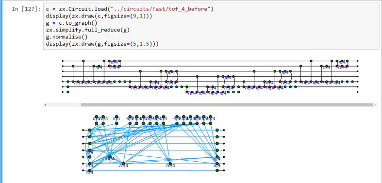

# Quantum circuit verification with PyZX

```{note}
**Chapter roles (Spring 2026)**  
Author: John Mulhern · Reviewer: Jack de Bruyn  
See [Chapter assignments](0-chapter-assignments.md).
```

This chapter introduces **PyZX** for reasoning about quantum circuits using the ZX-calculus.

## Goals

- Explain ZX diagrams as a compositional language for linear-algebraic operations behind circuits.
- Demonstrate simplification or verification of a small diagram in PyZX.
- Explore a further aspect depending on your interest.
- Link to PyZX documentation and papers on completeness and rewrite strategies.

# 3rd Draft: To Be submitted upon final review...

# PyZX: Reasoning About Quantum Circuits with Python and the ZX-Calculus

## General Idea

PyZX is a Python library for working with quantum circuits through the language of the **ZX-calculus**. At a high level, the ZX-calculus gives us a way to represent quantum processes as diagrams rather than only as matrices or gate sequences. These diagrams are not merely pictures; they are mathematical objects that can be rewritten, simplified, compared, and converted back into optimized quantum circuits.

The central idea behind this chapter is that PyZX gives programmers a practical bridge between three worlds:

1. **Quantum circuits**, which are usually written as sequences of gates.
2. **ZX-diagrams**, which represent the same underlying linear-algebraic transformations graphically.
3. **Python code**, which allows these diagrams to be generated, simplified, visualized, verified, and exported.

The PyZX paper describes the ZX-calculus as a graphical language for reasoning about ZX-diagrams, which are tensor-network-like objects capable of representing arbitrary linear maps between qubits in contrast to quantum gates which only correspond to unitary linear maps (see [chapter 10](https://github.com/LEAP-at-Chapman/CPSC-570-From-Bugs-to-Proofs/blob/main/book/content/10-qiskit.md) for more information). PyZX then automates reasoning over these diagrams, especially for circuit optimization, equality validation, and visualization.

This makes PyZX useful not just as a quantum programming tool, but as a **formal reasoning tool**. Instead of asking only “what gates are in this circuit?”, PyZX allows us to ask deeper questions:

- Can this circuit be simplified?
- Does this optimized circuit still compute the same operation?
- Can two different circuits be proven equivalent?
- Can a diagram reveal structure that is hidden in the original gate list?
- Can rewrite rules be used as a kind of automated proof system?

The PyZX FAQ describes ZX-diagrams as graphical representations of quantum processes and emphasizes that they can represent arbitrary linear maps, not only unitary circuits. It also highlights rewrite rules as one of the major reasons the ZX-calculus is useful.

## In this chapter we will

In this chapter, we will:

- Explain what ZX-diagrams are and why they matter for quantum computing.
- Introduce PyZX as a Python tool for creating, simplifying, visualizing, and verifying quantum circuits.
- Show how circuits can be translated into ZX-diagrams.
- Demonstrate a small PyZX workflow using Python code.
- Explain how simplification and verification work conceptually.
- Discuss typical use cases, including circuit optimization and equivalence checking.
- Explore how PyZX fits into the larger landscape of quantum software, formal methods, and AI-assisted reasoning.
- Connect PyZX to further readings on ZX-calculus, completeness, rewrite strategies, and graph rewriting.

## History

The ZX-calculus was introduced by Bob Coecke and Ross Duncan in 2008 as a graphical language for reasoning about quantum computation. Since then, it has become an important tool in quantum information, quantum circuit optimization, measurement-based quantum computing, lattice surgery, and quantum foundations. The PyZX paper notes that the ZX-calculus has developed complete rule sets, related graphical calculi such as ZW and ZH, and applications to areas such as measurement-based quantum computing, surface-code lattice surgery, and circuit optimization. 

The motivation behind PyZX is practical: if ZX-calculus is useful for reasoning about quantum circuits, then researchers and programmers need software that can apply these diagrammatic rules automatically. PyZX was created by Aleks Kissinger and John van de Wetering as an open-source Python library for large-scale automated diagrammatic reasoning. The authors describe PyZX as a tool for rewriting large ZX-diagrams using built-in simplification strategies, performing T-count optimization, validating optimized circuits, and visualizing diagrams.

PyZX is part of a broader ecosystem of ZX-calculus tools. The PyZX documentation and GitHub page describe it as a Python tool for creating, visualizing, and automatically rewriting large-scale quantum circuits using the ZX-calculus. Other tools, such as Quantomatic, support interactive theorem proving for diagrammatic reasoning, while newer projects explore alternative implementations and performance-focused rewrites. The attached LMNtal paper presents a complementary approach: instead of competing with PyZX as a high-performance optimizer, it uses a general-purpose graph rewriting language to explore and verify rewrite strategies through state-space search and model checking. 

## Basic uses for PyZX

PyZX can be used in several major ways:

1. **Create quantum circuits in Python**
2. **Import circuits from common formats**
3. **Convert circuits into ZX-diagrams**
4. **Simplify ZX-diagrams using rewrite strategies**
5. **Extract optimized circuits from simplified diagrams**
6. **Verify that two circuits are equivalent**
7. **Visualize circuits and diagrams**
8. **Export diagrams for use in papers or external tools**

The PyZX paper explains that PyZX supports circuit formats such as QASM, QC, and Quipper, and that it can export diagrams to TikZ or Quantomatic qGraph files. This is useful because it lets PyZX sit between ordinary quantum programming workflows and formal diagrammatic reasoning workflows.

PyZX is especially comfortable inside a Jupyter Notebook, where diagrams can be drawn inline. The paper specifically notes that PyZX works well in Jupyter because notebooks support interactive code, rich output, and visualization.

### Syntax

A basic PyZX session usually starts like this, where the user builds a simple circuit:

```python
import pyzx as zx

c = zx.Circuit(2)

c.add_gate("HAD", 0)
c.add_gate("CNOT", 0, 1)
c.add_gate("T", 1)

print(c)
```

This creates a simple two-qubit circuit. The exact gates are not the main point yet. What matters is that PyZX lets us treat the circuit as a Python object.

The next step is to convert the circuit into a ZX-diagram:
```python
g = c.to_graph()
```
Now `g` is a graph-like ZX representation of the circuit. PyZX’s internal model distinguishes between circuits and graphs. The PyZX paper explains that the two main data structures are Circuit, which wraps a list of gates, and Graph, which represents a ZX-diagram.

A user can then draw the diagram:
```python
zx.draw(g)
```
In a Jupyter Notebook, this produces a visual ZX-diagram. In this diagram, quantum operations are represented using connected graph structures rather than the usual left-to-right circuit notation.

## Using PyZX

The most important PyZX workflow is:

Circuit → ZX-diagram → Simplification → Verification or Circuit Extraction

In code, this looks roughly like:
```python
import pyzx as zx

# Step 1: Build a circuit
c = zx.Circuit(2)
c.add_gate("HAD", 0)
c.add_gate("CNOT", 0, 1)
c.add_gate("T", 1)

# Step 2: Convert the circuit to a ZX-diagram
g = c.to_graph()

# Step 3: Simplify the ZX-diagram
zx.simplify.full_reduce(g)

# Step 4: Draw the simplified diagram
zx.draw(g)
```
The important operation here is:
```python
zx.simplify.full_reduce(g)
```

This applies a powerful collection of rewrite strategies to the diagram. In PyZX, simplification is not just deleting redundant gates. It is graph rewriting based on the ZX-calculus.

At the lowest level are individual rewrite rules, each with a matcher and a rewriter. A matcher finds subgraphs where a rule can apply, and a rewriter changes the graph accordingly. Above that are basic simplifiers, which repeatedly apply a rule until it no longer matches. At the top are compound simplifiers, which combine multiple simplification routines into larger strategies.



**Figure 1. Example of simplifying a quantum circuit with PyZX.**  
This figure shows a circuit being converted into a ZX-diagram and then simplified using PyZX’s rewrite system. The upper diagram still resembles the original circuit structure, while the lower diagram shows the result after simplification. In the simplified version, PyZX has reorganized the computation into a graph of connected spiders and Hadamard edges. Although the lower diagram no longer looks like a standard gate-by-gate circuit, it represents the same underlying quantum operation. This illustrates the main advantage of PyZX: it can reason about circuits at the diagram level, where rewrite rules such as spider fusion, identity removal, local complementation, pivoting, and `full_reduce` can reveal simplifications that are difficult to see in ordinary circuit notation.

### Generators and Composition in ZX-Diagrams

ZX-diagrams are built from a small set of basic pieces called **generators**. The most important generators are **Z-spiders** and **X-spiders**, usually drawn as green and red nodes. A Z-spider represents structure in the computational basis, while an X-spider represents structure in the Hadamard-transformed basis. Each spider may have any number of input or output wires, and it may also carry a phase label such as $0$, $(\pi/2)$, or $(\pi/4)$. Hadamard gates are often represented by yellow boxes or by special Hadamard edges between spiders.

These generators can be composed in two main ways. First, they can be composed **sequentially** by connecting the output wires of one diagram to the input wires of another. This corresponds to ordinary function composition or matrix multiplication. Second, diagrams can be composed **in parallel** by stacking them vertically. This corresponds to the tensor product of linear maps. In other words, a ZX-diagram is not just a drawing: it represents a linear-algebraic operation built by connecting smaller operations together.

One reason ZX-diagrams are more flexible than ordinary circuit diagrams is that only the connectivity matters. Wires can bend, stretch, or move around as long as the same components remain connected in the same way. This makes ZX-diagrams useful for simplification because PyZX can apply rewrite rules directly to the graph structure rather than being restricted to the original gate-by-gate layout.

Mathematically, ZX-diagrams form what is called a **dagger compact category** ([for further reading, click here]( https://en.wikipedia.org/wiki/Dagger_compact_category)). Very briefly, this means the diagram language supports composition, tensor product, wire bending through cups and caps, and an adjoint-like operation called a dagger. This categorical structure is part of why ZX-diagrams behave so naturally as a language for quantum processes, but for this chapter, the key practical idea is simpler: PyZX uses these diagrams as graph-like representations that can be rewritten while preserving the meaning of the quantum computation.

## Applications in Industry

Quantum computing is still an emerging field, so “industry use” should be discussed carefully. PyZX is not usually presented as a finished commercial compiler by itself. Instead, it is best understood as a research-grade and prototype-friendly tool for circuit optimization, verification, and diagrammatic reasoning.

That said, the problems PyZX addresses are directly relevant to industrial quantum computing:

### Circuit optimization

Near-term quantum hardware has limited qubit counts, noisy gates, and expensive two-qubit operations. Any method that reduces gate count, circuit depth, or T-count can be valuable. PyZX is especially associated with reducing non-Clifford resources, such as T gates, which are important in fault-tolerant quantum computing. The original PyZX paper specifically highlights T-count optimization as one of the major achievements of PyZX’s rewrite strategies.

### Verification of optimized circuits

Optimization is only useful if the optimized circuit still computes the same function. PyZX supports equality validation between original and optimized circuits, making it useful as a checking layer in quantum compilation workflows. The paper describes both tensor comparison and rewrite-based equality checking as validation methods.

### Compiler research

PyZX can serve as an intermediate representation for experimenting with compiler transformations. Because diagrams can be rewritten according to formal rules, PyZX provides a way to test ideas that may later be incorporated into larger compiler stacks.

### Tool interoperability

PyZX interacts with several external formats and tools. The PyZX paper describes support for QASM, QC, Quipper, TikZ, and Quantomatic qGraph files. It also notes that PyZX can export diagrams as TikZ figures for LaTeX documents and can interact with Quantomatic for graphical theorem proving.

### Typical Use Cases
#### 1. Learning the ZX-calculus
PyZX is useful for students because it makes abstract rewrite rules visible. Instead of only reading equations in a textbook, a student can construct a circuit, convert it to a diagram, simplify it, and inspect what changed.

#### 2. Checking circuit equivalence
Given two circuits, PyZX can be used to test whether they implement the same operation. This is useful when comparing a hand-written circuit to an optimized version.
```python
equivalent = c1.verify_equality(c2)
print(equivalent)
```

#### 3. Optimizing quantum circuits
PyZX can simplify a circuit by converting it into a ZX-diagram, applying rewrite rules, and extracting a new circuit.
```python
g = c.to_graph()
zx.simplify.full_reduce(g)
c_opt = zx.extract.extract_circuit(g.copy())
```

#### 4. Visualizing quantum structure

Some circuit identities are difficult to see in gate notation but become clearer in ZX form. PyZX supports visualizations through notebook-based drawing tools, Matplotlib, D3-style visualization, and TikZ export.

#### 5. Testing rewrite strategies

PyZX’s simplification system can be studied as an example of automated graph rewriting. Related research on LMNtal and QLMNtal argues that general graph-rewriting languages can complement PyZX by allowing researchers to model rewrite strategies, explore state spaces, and analyze properties such as termination and confluence.

## PyZX and AI

PyZX has an interesting relationship with AI because quantum circuit optimization can be viewed as a search problem. Given a circuit, there may be many possible rewrite paths. Some paths simplify the diagram quickly. Others may temporarily increase complexity but lead to a better final result. Still others may lead to dead ends.

This is where AI and machine learning become relevant. A learning system might help choose which rewrite rule to apply, predict promising simplification paths, or recommend optimization strategies for different circuit families. The LMNtal paper describes rewrite-strategy exploration as a way to study optimization paths and even identify heuristics. For example, it reports that applying certain rules early may lead to dead ends, while applying other rules later may lead to more successful simplifications.

A possible AI-assisted PyZX workflow could look like this:
```python
Input circuit
    ↓
Convert to ZX-diagram
    ↓
Generate possible rewrite actions
    ↓
Use heuristic / learned model to choose promising rewrites
    ↓
Simplify diagram
    ↓
Extract optimized circuit
    ↓
Verify equivalence with PyZX
```
This is an important distinction. In a safety-critical or correctness-sensitive setting, AI should not be trusted merely because it suggests an optimization. The optimized result should still be checked using formal or semi-formal validation tools such as PyZX’s equality verification.

## Limitations

PyZX is powerful, but it is not magic. Several limitations should be noted.

First, tensor-based validation scales exponentially with the number of qubits, since the underlying matrix or tensor representation grows rapidly. The PyZX paper notes that tensor comparison can validate circuits up to around 10 qubits in practice under the described setup, but larger circuits require rewrite-based methods.

Second, extracting a circuit from a simplified ZX-diagram is not always trivial. The PyZX paper identifies this as the circuit extraction problem. A simplified ZX-diagram may no longer visually resemble a circuit, so PyZX needs extraction algorithms and heuristics to convert it back into gate form.

Third, rewrite strategies are heuristic in practice. If PyZX verifies equality, that is strong evidence under the implemented strategy, but failure to verify does not necessarily prove two circuits are unequal. It may only mean the simplification strategy did not find a proof.

## Recommended Reading
### [PyZX documentation](https://pyzx.readthedocs.io/en/latest/)
The PyZX documentation is the best starting point for installation, syntax, supported gates, circuit import/export, simplification, and API details. It includes getting-started notebooks, supported-gates examples, optimization tutorials, and graph manipulation documentation.

### [PyZX FAQ](https://pyzx.readthedocs.io/en/latest/faq.html)
The PyZX FAQ gives a beginner-friendly explanation of ZX-diagrams, why the ZX-calculus is useful, what PyZX can do, and what it is not good at. It is especially useful for writing the conceptual introduction of this chapter.

### [Picturing Quantum Software](https://zxcalc.github.io/book/html/main_html.html)
Aleks Kissinger and John van de Wetering’s Picturing Quantum Software is a major textbook-style resource for learning the ZX-calculus and quantum compilation. The online version includes chapters on quantum circuits, CNOT circuits, Clifford diagrams, completeness, Clifford+T circuits, and compilation techniques.

### [PyZX paper](https://arxiv.org/pdf/1904.04735)
The original PyZX paper, PyZX: Large Scale Automated Diagrammatic Reasoning, introduces PyZX as an open-source library for automated reasoning with large ZX-diagrams. It covers ZX basics, PyZX’s circuit and graph data structures, simplification, verification, circuit extraction, visualization, and integration with other tools.

### [Graph rewriting and model checking paper](https://arxiv.org/pdf/2511.15581v1)
The LMNtal/QLMNtal paper provides a useful contrast to PyZX. It treats ZX-calculus rewriting as a graph-rewriting and model-checking problem, emphasizing state-space exploration, strategy verification, and experimentation with rewrite systems.

## Conclusion
PyZX is a powerful example of how abstract mathematical reasoning can become practical software. The ZX-calculus provides a graphical language for representing quantum processes, while PyZX turns that language into programmable Python objects, rewrite strategies, visualizations, and verification tools.

The main lesson of PyZX is that quantum circuits do not need to be understood only as gate sequences. They can also be understood as diagrams with algebraic meaning. Once circuits become diagrams, they can be rewritten, simplified, compared, and optimized using rules that preserve their semantics.

For students and researchers, PyZX is valuable because it makes this process concrete. A user can build a circuit, convert it into a ZX-diagram, apply simplification, extract a new circuit, and verify that the result is equivalent. For compiler research, PyZX provides a platform for testing optimization methods. For formal methods, it connects quantum computation to graph rewriting and equivalence checking. For AI, it suggests a promising search space where learned heuristics can guide rewrite strategies while formal tools preserve correctness.

In short, PyZX shows how Python can be used not just to simulate quantum circuits, but to reason about them.